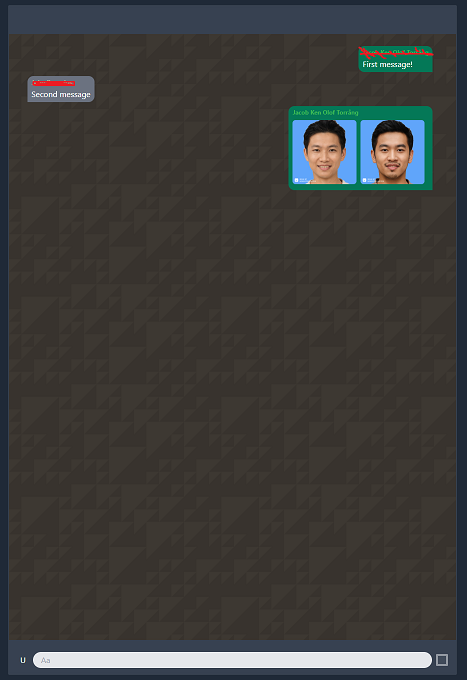

# ReScript chat app
This is a simple chat app built with [ReScript](https://rescript-lang.org/), [Snowpack](https://www.snowpack.dev/), [pnpm](https://pnpm.js.org/), [Firebase](https://firebase.google.com/firebase-and-gcp) and [tailwindcss](https://tailwindcss.com/). It was made to try out using ReScript in a functional application. This is my first ReScript project so if things are funky, _that's why_.

## Try it out
To run the application

```bash
npm i -g pnpm
pnpm i
pnpm start
```

## To deploy
You need to set up [Firebase](https://firebase.google.com/firebase-and-gcp) and then you need to change `public/config.js` to your own configuration. Then it should be possible to deploy.

## Plugins
Recommended to use [rescript-vscode](https://marketplace.visualstudio.com/items?itemName=chenglou92.rescript-vscode)

## Screenshots
